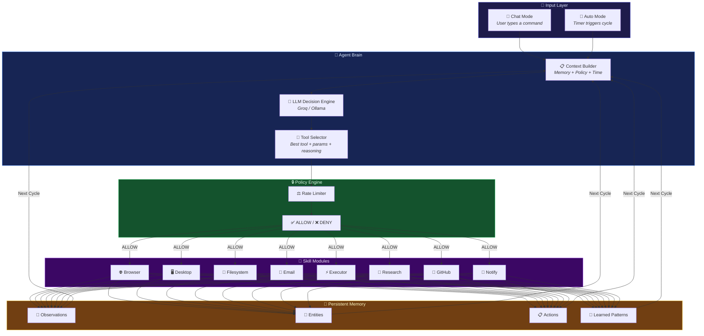

<div align="center">

<br>

<picture>
  <source media="(prefers-color-scheme: dark)" srcset="https://img.shields.io/badge/%E2%9A%A1_RKTM83-Autonomous_AI_Agent-blueviolet?style=for-the-badge&labelColor=0d1117&color=8b5cf6">
  
</picture>

<br><br>

### Modular AI Agent with Multi-Skill Execution Framework

<br>

[](https://python.org)
[](LICENSE)
[]()
[]()
[]()
[]()
[](CONTRIBUTING.md)

<br>

> *An autonomous agent that thinks, acts, and remembers — powered by LLMs, built with pluggable skills, and designed to run on your own hardware.*

<br>

[Overview](#-overview) · [Architecture](#-architecture) · [Features](#-features) · [Skills](#-skills) · [Installation](#-installation) · [Usage](#-usage) · [Config](#-configuration) · [Contributing](#-contributing)

---

</div>

<br>

## 📖 Overview

**RKTM83** is a modular autonomous AI agent built on a skill-based execution architecture. Instead of a monolithic AI that tries to do everything, RKTM83 uses **independent skill modules** that the agent dynamically selects and executes based on context, memory, and policy constraints.

It operates in two modes — **autonomous** (continuous background execution) and **interactive** (chat-based). A three-layer engine inspired by [NVIDIA NemoClaw](https://developer.nvidia.com/blog/building-agentic-ai-applications-with-nvidia-nemoclaw/) handles decision-making, memory, and guardrails.

> **10 skills · 22+ tools · Persistent vector memory · Policy guardrails · Runs locally on consumer GPUs**

<br>

## 🏗 Architecture

<div align="center">



</div>

<br>

### Three-Layer Engine

<table>
<tr>
<td align="center" width="33%">

**🔒 Policy Engine**

Rate limits · Guardrails
ALLOW / ROUTE / DENY
Human approval gates

</td>
<td align="center" width="33%">

**💾 Agent Memory**

ChromaDB vector store
4 collections · Persists forever
Semantic search over history

</td>
<td align="center" width="33%">

**🧠 Agent Brain**

LLM decision engine
Groq API / Local Ollama
Picks best tool each cycle

</td>
</tr>
</table>

<br>

## ✨ Features

<table>
<tr>
<td width="50%" valign="top">

### 🧩 Modular Skill System
Each skill is an independent Python module with its own tools. Enable, disable, or build custom skills by editing one line in `config.yaml`.

### 🧠 Intelligent Tool Selection
The LLM brain evaluates context, memory, and available tools to choose the optimal action — with reasoning.

### 💬 Dual Interaction Modes
Run autonomously in the background *or* interact via `--chat` mode. Same skills, same tools, different interface.

</td>
<td width="50%" valign="top">

### 🔒 Guardrails & Safety
Policy engine enforces rate limits per action type. Executor runs in a subprocess sandbox. Email requires human approval.

### 📦 Persistent Memory
ChromaDB vector store with four collections — observations, entities, actions, and learned patterns. Survives restarts.

### ⚙️ Zero-Code Config
Identity, personality, skills, brain provider, policy limits — everything in `config.yaml`. No code changes needed.

</td>
</tr>
</table>

<br>

## 🧩 Skills

> **10 skill modules · 22+ tools · Fully pluggable** — drop a Python file, add one line to config, restart.

<br>

<table>
<tr>
<th align="left">Skill</th>
<th align="left">Tools</th>
<th align="left">Description</th>
</tr>

<tr><td>🌐 <b>Browser</b></td>
<td><code>browse_url</code> · <code>fill_form</code> · <code>click_element</code> · <code>search_web</code></td>
<td>Playwright — navigate sites, fill forms, click buttons, Google search</td></tr>

<tr><td>🖥️ <b>Desktop</b></td>
<td><code>open_app</code> · <code>type_text</code> · <code>screenshot</code> · <code>hotkey</code></td>
<td>Launch apps, type text, capture screen, send keyboard shortcuts</td></tr>

<tr><td>📁 <b>Filesystem</b></td>
<td><code>list_files</code> · <code>read_file</code> · <code>move_file</code> · <code>organize_folder</code></td>
<td>Browse, read, move files, auto-sort Downloads by type</td></tr>

<tr><td>📧 <b>Email</b></td>
<td><code>send_email</code> · <code>read_inbox</code> · <code>reply_email</code></td>
<td>Gmail integration with configurable human approval gate</td></tr>

<tr><td>⚡ <b>Executor</b></td>
<td><code>execute_task</code> · <code>run_code</code></td>
<td>Describe task in English → LLM writes Python → sandboxed execution</td></tr>

<tr><td>🔬 <b>Research</b></td>
<td><code>search_professors</code> · <code>search_papers</code> · <code>track_lab</code></td>
<td>Semantic Scholar + web search for papers, professors, labs</td></tr>

<tr><td>🐙 <b>GitHub</b></td>
<td><code>search_repos</code> · <code>find_issues</code> · <code>track_contribution</code></td>
<td>Discover repos, find good-first-issues, track contributions</td></tr>

<tr><td>🔔 <b>Notify</b></td>
<td><code>notify</code></td>
<td>Windows desktop toast notifications on events</td></tr>

<tr><td>💼 <b>Career</b></td>
<td><code>search_opportunities</code> · <code>score_opportunity</code> · <code>draft_outreach</code> +2</td>
<td>Opportunity discovery with LLM scoring (optional)</td></tr>

<tr><td>🧪 <b>Custom</b></td>
<td><i>Your tools here</i></td>
<td>Template — copy, rename, build your own skill module</td></tr>

</table>

<br>

<details>
<summary><b>🛠️ How to create a custom skill</b></summary>

<br>

```python
# skills/my_skill.py

SKILL_NAME = "my"

def _my_tool(params, context, brain):
    """Your tool logic here."""
    result = do_something(params.get("input", ""))
    brain.memory.observe("Did something", {"source": "my_skill"})
    return {"success": True, "output": result}

def register(agent):
    agent.brain.register_tool(
        "my_tool",
        "Description of what this tool does",
        _my_tool
    )
    return agent
```

Then add `my` to your `config.yaml` skills list and restart.

</details>

<br>

## 🔄 How It Works

```mermaid
sequenceDiagram
    participant U as 🧑 User / Timer
    participant B as 🧠 Brain
    participant P as 🔒 Policy
    participant S as 🧩 Skill
    participant M as 💾 Memory

    rect rgb(30, 27, 75)
    Note over U,M: Each Cycle (~30 seconds)
    end

    U->>B: Trigger (chat input or timer)
    
    B->>M: Load context (last actions, observations)
    M-->>B: Recent memory + patterns
    
    B->>B: LLM decides best tool + params
    
    B->>P: Check permission (rate limits)
    
    alt ALLOW ✅
        P-->>B: Approved
        B->>S: Execute selected skill tool
        S->>S: Run tool handler
        S->>M: Store result (observation + action)
        S-->>B: Return result
        B-->>U: Display output
    else DENY ❌
        P-->>B: Rate limit reached
        B-->>U: Action denied — waiting
    end
```

<div align="center">



</div>

<br>

<div align="center">

**Cycle Flow**

`🔄 Wake` → `📋 Read Memory` → `🧠 LLM Thinks` → `🎯 Pick Tool` → `🔒 Policy Check` → `⚡ Execute` → `💾 Remember` → `😴 Sleep` → `🔄 Repeat`

</div>

<br>

## 🚀 Installation

```bash
# Clone the repository
git clone https://github.com/rktm0604/RKTM83.git
cd RKTM83

# Install dependencies
pip install -r requirements.txt

# Install Playwright browser (for browser skill)
playwright install chromium

# Pull LLM model (if using local Ollama)
ollama pull llama3.2:3b
```

<br>

## ▶️ Usage

<table>
<tr>
<td width="50%">

### 💬 Interactive Mode

```bash
python run_agent.py --chat
```

```
[RKTM83] > open notepad
→ Tool: open_app
→ Why:  Launch Notepad for the user
✓ Success — app: notepad

[RKTM83] > search google for AI agents
→ Tool: search_web
✓ Success — 5 results

[RKTM83] > organize my downloads
→ Tool: organize_folder
✓ Plan: Images(12) Docs(8) Code(5)
```

</td>
<td width="50%">

### 🔄 Autonomous Mode

```bash
python run_agent.py
```

```
Cycle 1 → search_papers
  Found 12 papers on RAG

Cycle 2 → find_issues
  Found 5 good-first-issues

Cycle 3 → notify
  Sent desktop notification

Cycle 4 → wait
  Nothing urgent, sleeping...
```

</td>
</tr>
</table>

<br>

**Other commands:**

```bash
python run_agent.py --cycles 5 --cycle-sleep 10   # limited test run
python run_agent.py --status                       # check agent status
python run_agent.py --test-skills                  # verify skill loading
python dashboard.py                                # launch Gradio dashboard
python supervisor.py                               # auto-restart on crash
```

<br>

## 🔐 Environment Setup

```bash
cp env.example .env    # copy template, then fill in your values
```

| Variable | Required | Source |
|:---------|:--------:|:-------|
| `GROQ_API_KEY` | ✦ Recommended | Free at [console.groq.com](https://console.groq.com) |
| `RAKBOT_GMAIL_EMAIL` | For email | Your Gmail address |
| `RAKBOT_GMAIL_PASSWORD` | For email | [App password](https://myaccount.google.com/apppasswords) (not your real password) |
| `GITHUB_TOKEN` | Optional | [Personal access token](https://github.com/settings/tokens) for higher API limits |

> **.env is gitignored — your credentials never leave your machine.**

<br>

## ⚙️ Configuration

Everything lives in `config.yaml` — zero code changes needed:

```yaml
brain:
  provider: "groq"                     # or "ollama" for local
  groq_model: "llama-3.1-70b-versatile"
  fallback: true                       # auto-fallback to Ollama

skills:
  - browser                            # comment any line to disable
  - desktop
  - filesystem
  - email
  - executor
  - research
  - github
  - notify

email:
  require_approval: true               # false = fully autonomous
  
executor:
  allow_dangerous: false               # sandboxed by default
  timeout: 10
  
policy:
  llm_calls_per_day: 150
  search_calls_per_hour: 10
  outreach_per_day: 5
```

<br>

## 📁 Project Structure

```
RKTM83/
│
├── 🧠 agent_brain.py              Core engine (PolicyEngine · AgentMemory · AgentBrain · Agent)
├── 🚀 run_agent.py                Launcher (--chat / autonomous / --status / --test-skills)
├── ⚙️ config.yaml                 All configuration lives here
├── 📊 dashboard.py                Gradio web dashboard
├── 🔄 supervisor.py               Process supervisor with auto-restart
├── 🛡️ resilience.py               Circuit breaker + tenacity retry wrappers
├── 📦 requirements.txt            Dependencies
├── 🔐 env.example                 Environment variable template
│
├── 🧩 skills/
│   ├── browser_skill.py           Playwright browser automation
│   ├── desktop_skill.py           pyautogui desktop control
│   ├── filesystem_skill.py        File operations
│   ├── email_skill.py             Gmail send / read / reply
│   ├── executor_skill.py          Sandboxed code execution
│   ├── research_skill.py          Semantic Scholar + web search
│   ├── github_skill.py            Repos, issues, contributions
│   ├── notify_skill.py            Windows toast notifications
│   ├── career_skill.py            Opportunity hunting (optional)
│   └── custom_skill.py            Your template
│
├── 🧪 tests/
│   ├── test_policy.py             PolicyEngine unit tests
│   ├── test_memory.py             AgentMemory unit tests
│   ├── test_executor.py           Executor safety tests
│   ├── test_filesystem.py         Filesystem tests
│   └── test_career.py             Career skill tests
│
└── 📚 docs/
    └── RKTM83_DOCS.md             Full documentation
```

<br>

## 🗺 Roadmap

- [x] Three-layer engine (Policy · Memory · Brain)
- [x] 10 pluggable skills with 22+ tools
- [x] Interactive chat mode + autonomous mode
- [x] Groq API + Ollama fallback
- [x] Process supervisor with auto-restart
- [x] Circuit breaker for external APIs
- [x] Gradio web dashboard
- [x] Unit tests + GitHub Actions CI
- [ ] Docker-based executor sandbox
- [ ] Multi-agent orchestration
- [ ] Voice interface
- [ ] Mobile companion app

<br>

## 🤝 Contributing

Contributions, issues, and feature requests are welcome.

See the [**Contributing Guide**](CONTRIBUTING.md) for details.

```
Fork → Branch → Code → Test → Pull Request
```

<br>

---

<div align="center">

<br>

Built by [**Raktim Banerjee**](https://github.com/rktm0604) · BTech CSE · NIIT University

Architecture inspired by [NVIDIA NemoClaw](https://developer.nvidia.com/blog/building-agentic-ai-applications-with-nvidia-nemoclaw/)

<br>

⭐ Star this repo if you find it interesting

<br>

<sub>If this agent becomes sentient, I take full responsibility. 🤖</sub>

<br>

</div>
