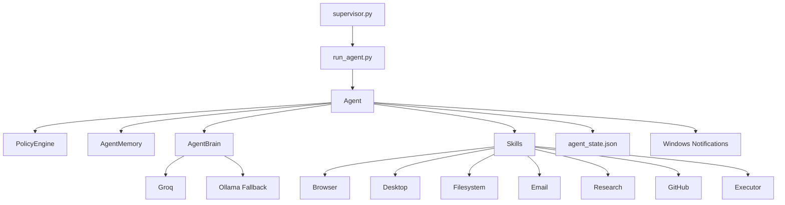

<div align="center">

# RKTM83

### Personal Autonomous Agent for Windows

[](https://github.com/rktm0604/RKTM83/actions/workflows/test.yml)
[](https://python.org)
[](https://groq.com)
[](https://ollama.ai)
[](https://www.trychroma.com)
[](LICENSE)

**Groq-first autonomous agent with browser, desktop, filesystem, email, research, and GitHub skills.**

*"Running on an RTX 3050 and pure ambition."*

[Quick Start](#quick-start) · [Capabilities](#capabilities) · [Architecture](#architecture) · [Configuration](#configuration) · [Roadmap](#roadmap)

</div>

---

## Overview

RKTM83 is a local-first autonomous agent designed to run on your own machine, make decisions cycle by cycle, execute tools, remember what happened, and recover from failure without starting from zero.

It supports both:

- `Autonomous mode` for continuous background operation
- `Chat mode` for direct interactive control

## Why This Repo Is Different

- `Groq-first brain` with Ollama fallback
- `Persistent vector memory` using ChromaDB
- `Crash recovery` with saved agent state
- `Self-healing loop` with backoff after repeated failures
- `Windows notifications` for success and error summaries
- `Supervisor process` for restart-on-crash behavior
- `Subprocess executor sandbox` instead of in-process `exec()`
- `GitHub Actions CI` with offline-safe tests

## Capabilities

| Area | What RKTM83 Can Do |
|---|---|
| `Brain` | Use Groq by default and fall back to Ollama when needed |
| `Browser` | Open pages, search the web, click elements, and fill forms with Playwright |
| `Desktop` | Open apps, type text, take screenshots, and send hotkeys |
| `Filesystem` | List files, read files, move files, and organize folders |
| `Email` | Read inbox, send email, and draft replies once Gmail credentials are set |
| `Research` | Search papers, labs, and professors |
| `GitHub` | Search repos, find issues, and track contribution targets |
| `Executor` | Generate Python for a task and run it in a subprocess sandbox |
| `Memory` | Store observations, actions, entities, and learned patterns |
| `Ops` | Resume from state, notify on results, restart after crashes, and run under a supervisor |

## Architecture



## Quick Start

```bash
git clone https://github.com/rktm0604/RKTM83.git
cd RKTM83
pip install -r requirements.txt
python -m playwright install chromium
```

Create a `.env` later with the credentials you want to enable:

```env
GROQ_API_KEY=your_groq_key
RAKBOT_GMAIL_EMAIL=your_email@gmail.com
RAKBOT_GMAIL_PASSWORD=your_gmail_app_password
GITHUB_TOKEN=optional_but_recommended
```

Then run:

```bash
# Interactive chat mode
python run_agent.py --chat

# Autonomous mode
python run_agent.py

# Status and health checks
python run_agent.py --status
python run_agent.py --test-skills

# Keep it alive like a service
python supervisor.py
```

## Example Daily Uses

- Track fresh AI/ML papers
- Hunt for beginner-friendly GitHub issues
- Organize local folders safely with dry-run support
- Open apps and automate repetitive browser flows
- Run short Python tasks in an isolated subprocess
- Notify you when the agent completes or fails an action

## Configuration

Everything important is driven from [`config.yaml`](config.yaml).

Key runtime settings now include:

```yaml
brain:
  provider: "groq"
  groq_model: "llama-3.1-70b-versatile"
  ollama_model: "llama3.2:3b"
  fallback: true

notifications:
  enabled: true
  on_success: true
  on_error: true
```

## Project Structure

```text
RKTM83/
├── agent_brain.py
├── run_agent.py
├── supervisor.py
├── dashboard.py
├── resilience.py
├── config.yaml
├── requirements.txt
├── skills/
│   ├── browser_skill.py
│   ├── desktop_skill.py
│   ├── filesystem_skill.py
│   ├── email_skill.py
│   ├── executor_skill.py
│   ├── research_skill.py
│   ├── github_skill.py
│   ├── notify_skill.py
│   ├── career_skill.py
│   └── custom_skill.py
└── tests/
    ├── test_policy.py
    ├── test_memory.py
    ├── test_executor.py
    ├── test_filesystem.py
    └── test_career.py
```

## Reliability Upgrades

- `Groq + fallback`: stronger default reasoning with local fallback
- `Retry + circuit breaker`: less fragile external API handling
- `State persistence`: resume from `agent_state.json`
- `Supervisor`: restart after a process crash
- `Notifications`: immediate Windows toast summaries
- `CI`: GitHub Actions test workflow on push and pull request

## Roadmap

- [x] Groq-first inference with Ollama fallback
- [x] Crash recovery and self-healing loop
- [x] Windows toast notifications
- [x] Supervisor process for restart-on-crash
- [x] Executor subprocess sandbox
- [x] Retry and circuit-breaker hardening
- [x] GitHub Actions CI
- [ ] Better dashboard visuals and controls
- [ ] Scheduled workflows and recurring jobs
- [ ] Richer planning and multi-step task memory

---

<div align="center">

Built by [Raktim Banerjee](https://github.com/rktm0604)

</div>
